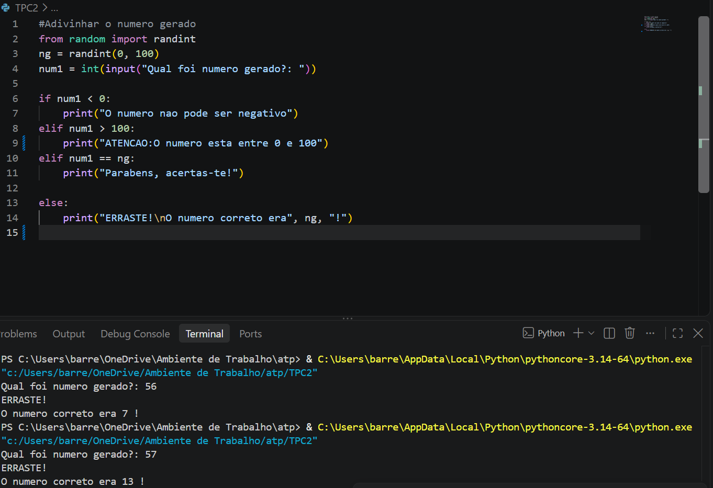

# ATP2026
## Autor
- Cristiana Barreto 
- a115292
- 

# Resumo 
- Criei um codigo onde eu tento adivinhar o numero gerado pelo programa, utilizo o random para este me escolher um numero aleatorio entre o invalo sujerido e para o numero nao ser sempre igual a cada vez que o programa e corrigo utilizo o randint, fazendo que este escolha sempre diferente. Acrescento as varias respostas que podem ocorrer como o numero ser negativo, ultapassar o 100, errar ou acertar.

# Resultados 
- 

